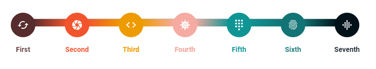

# material-state-component

This component is based on **material-ui** library. It helps to represent state flows.

> Made with create-react-library

[](https://www.npmjs.com/package/material-state-component) [](https://standardjs.com)

## Install

```bash
npm install --save material-state-component
```

## Usage

[Demo](https://codesandbox.io/s/interesting-kirch-lqkbxg?file=/src/App.js)

```jsx
import React from 'react'
import CachedIcon from '@mui/icons-material/Cached';
import CameraIcon from '@mui/icons-material/Camera';
import CodeIcon from '@mui/icons-material/Code';
import CoronavirusIcon from '@mui/icons-material/Coronavirus';
import DialpadIcon from '@mui/icons-material/Dialpad';
import FingerprintIcon from '@mui/icons-material/Fingerprint';
import GraphicEqIcon from '@mui/icons-material/GraphicEq';
import StateComponent from 'material-state-component';

export const states = [
  {
    label: 'First',
    color: '#562C2C',
    icon: <CachedIcon />,
  },
  {
    label: 'Second',
    color: '#F2542D',
    icon: <CameraIcon />,
  },
  {
    label: 'Third',
    color: '#ee9b00',
    icon: <CodeIcon />,
  },
  {
    label: 'Fourth',
    color: '#f5aba2',
    icon: <CoronavirusIcon />,
  },
  {
    label: 'Fifth',
    color: '#0E9594',
    icon: <DialpadIcon />,
  },
  {
    label: 'Sixth',
    color: '#127475',
    icon: <FingerprintIcon />,
  },
  {
    label: 'Seventh',
    color: '#001219',
    icon: <GraphicEqIcon />,
  },
];

const App = () => {
  return (
    <div style={{margin: '10rem'}}>
      <StateComponent currentState={'Seventh'} states={states}/>
    </div>
  );
};

export default App;

```



## License

MIT © [mlaina](https://github.com/mlaina)
